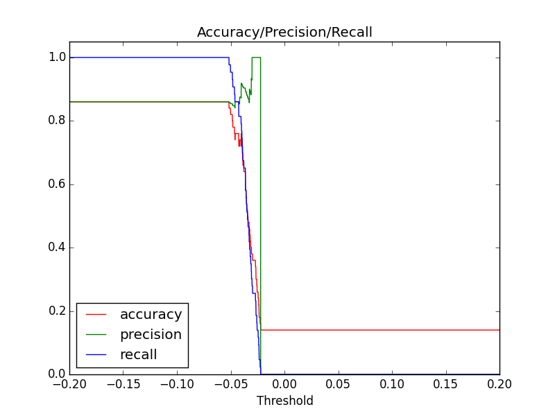
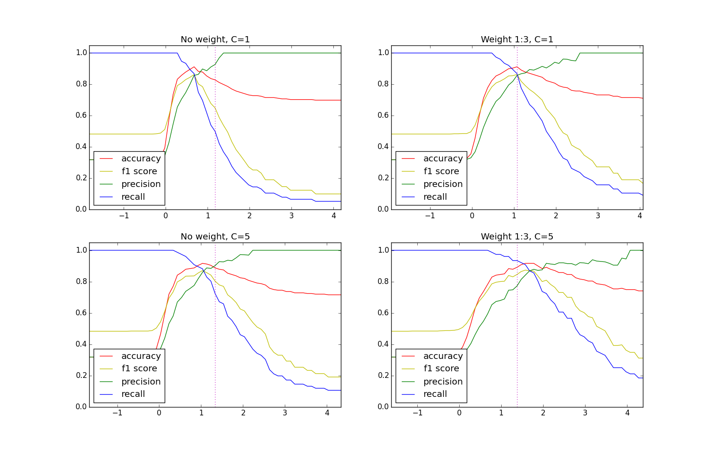
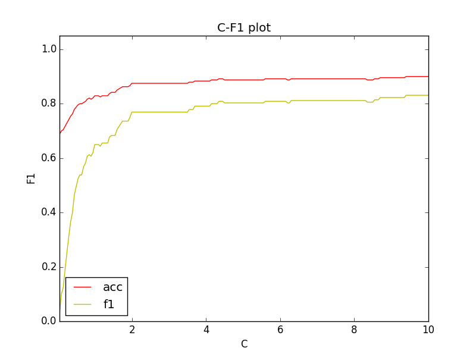
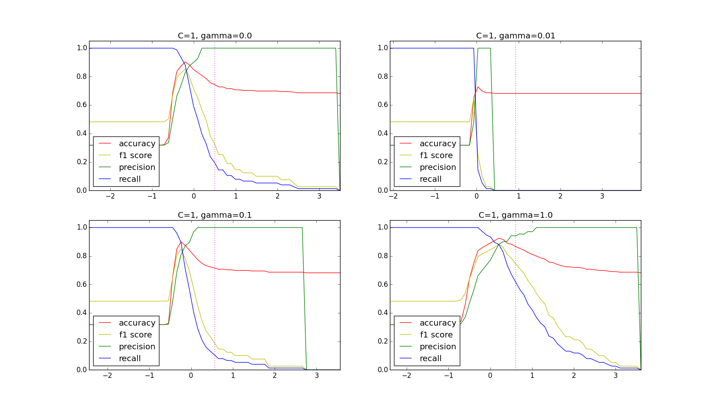
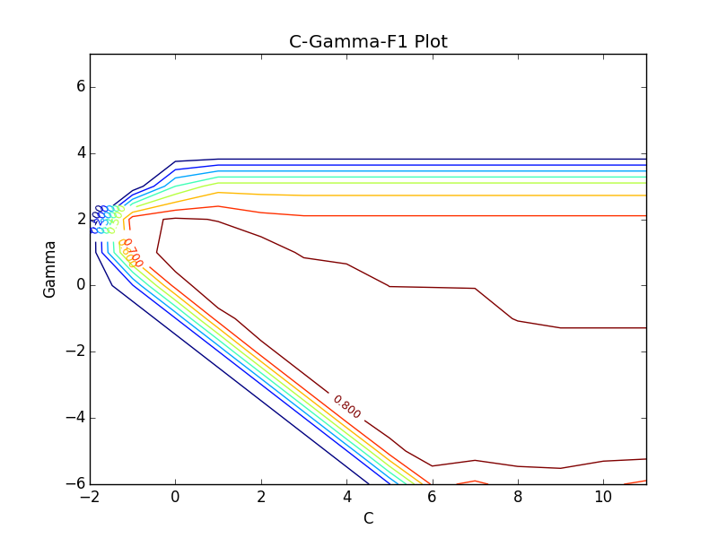

# README

## Setup Environment on MAC

[Reference](https://joernhees.de/blog/2014/02/25/scientific-python-on-mac-os-x-10-9-with-homebrew/)

### Setup taps and update brew

Link to homebrew science repos

	brew tap homebrew/science # a lot of cool formulae for scientific tools
	brew tap homebrew/python # numpy, scipy
	brew update && brew upgrade

### Install a brewed python
	brew install python
	
	which python
	# should say /usr/local/bin/python
	echo $PATH
	# /usr/local/bin should appear in front of /usr/bin

### Install related libraries

	# install PIL, imagemagick, graphviz and other
	# image generating stuff (qt is nice for viewing)
	ln -s /usr/local/include/freetype2 /usr/local/include/freetype # seems freetype can't be found on some systems
	brew install pillow imagemagick graphviz
	brew install cairo --without-x
	brew install py2cairo # this will ask you to download xquartz and install it
	brew install qt pyqt

	# install nose (unittests & doctests on steroids)
	pip install virtualenv nose

	# install numpy and scipy
	brew install numpy # --with-openblas
	brew install scipy # --with-openblas

	# test the numpy & scipy install
	brew test numpy
	brew test scipy

	# some cool python libs (if you don't know them, look them up)
	# time series stuff, natural language toolkit
	# generate plots, symbolic maths in python, fancy debugging output
	pip install pandas nltk
	brew install matplotlib
	pip install sympy q

	----> below are not related to science, just supportive

	# ipython and notebook support
	brew install zmq
	pip install ipython[zmq,qtconsole,notebook,test]

	# html stuff (parsing)
	pip install html5lib cssselect pyquery lxml BeautifulSoup

	# webapps / apis (choose what you like)
	pip install Flask Django

	# semantic web stuff: rdf & sparql
	pip install rdflib SPARQLWrapper

## Basics of SVM

A good dataset for SVM analytics is when (number of samples)  >> (features), eg. 100 vs 10

The feature of the datasets should be numberic, not categorical

Eg. wholesale_customers.csv [url]() is 6 numberic features and 440 samples.

### Process to train SVM classifier

* Scale: There are many ways to scale. I use [MinMaxScaler]() which scale feature between 0 & 1
* Choose parameters: Kernel - linear (C: higher the more accurate, may overfit), rbf (gamma: smaller more dedicate)
* Train: Normally half dataset to train and half to validate is a good start, or for more advance - cross validation
* Predict: Manually tune classifier, eg. b, as seen in c_

## How to use

### Fertility

This dataset is a 2 class dataset, to predict if can fertilize or not. It has mostly true outcomes, so SVM does not work too well. Basically all predictions are true whatever parameters are used.

	cd fertility
	python svm_predict_engine.py fertility.csv

Below is plotted by C=1 using linear kernel.

### Wholesale customers

This data is a 2 class dataset, to predict if the channel is retail or distributor. it has 440 samples and 6 features, and mostly are numeric, so it's suitable for SVM. I filtered the categorical variable.

#### Using linear kernel

	python process.py wholesale_customers.csv
	python predict_linear.py wholesale_customers_processed.csv

#### Optimize by threshold

#### Optimize by C

#### Using rbf kernel

	python process.py wholesale_customers.csv
	python predict_rbf.py wholesale_customers_processed.csv

#### Optimize by threshold

#### Optimizing by C & gamma

